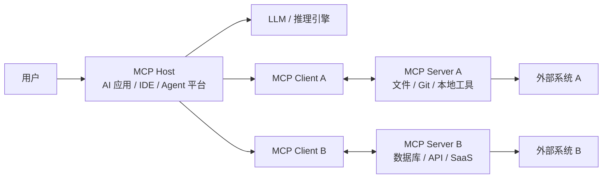
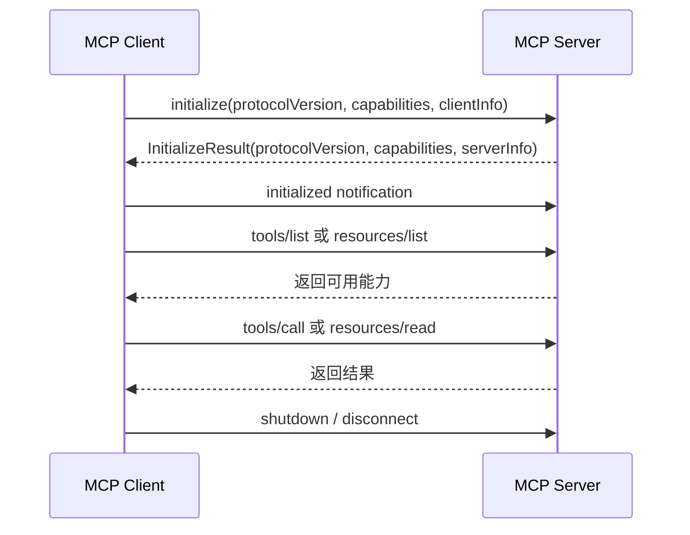
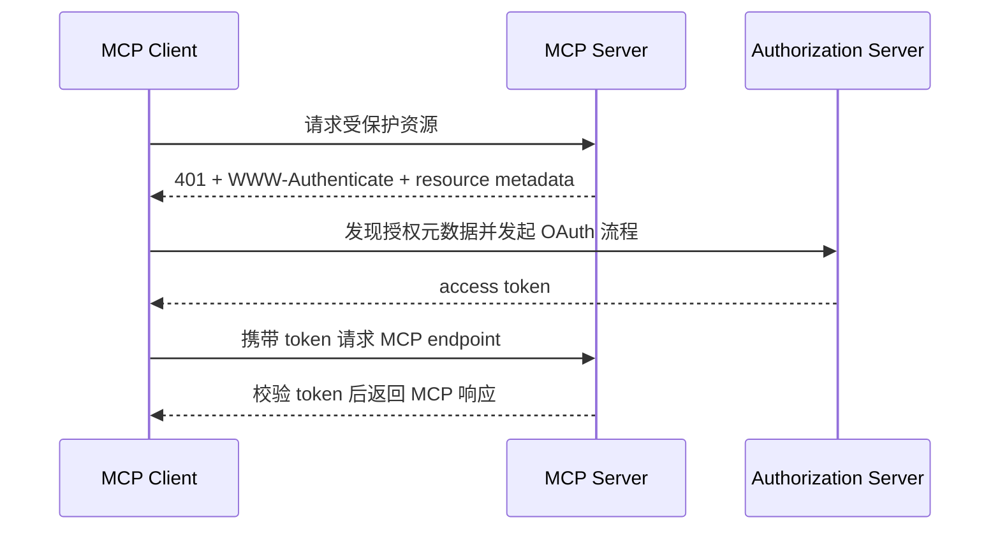
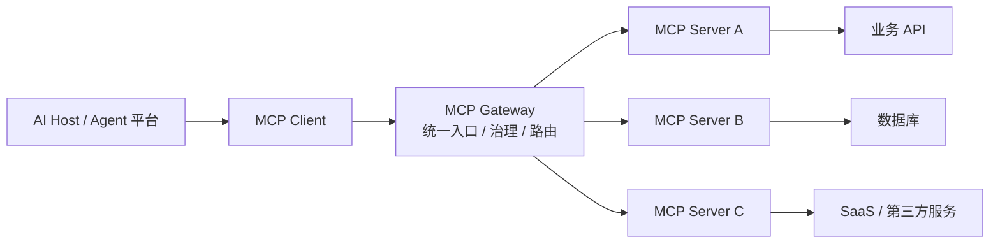
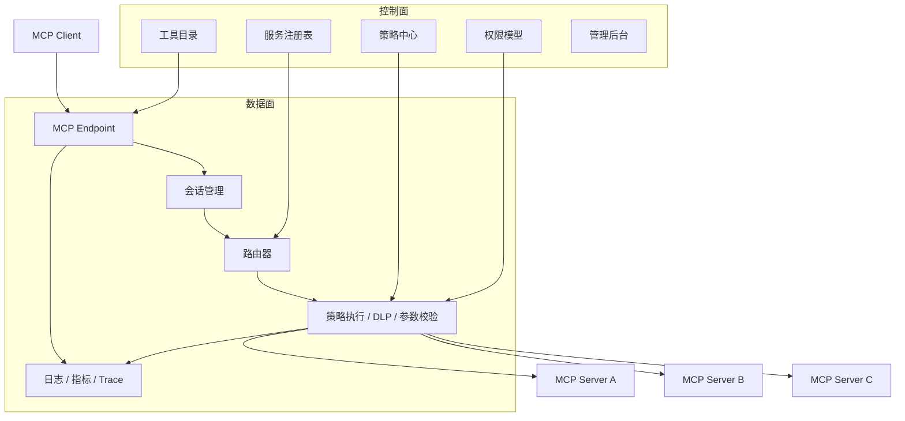
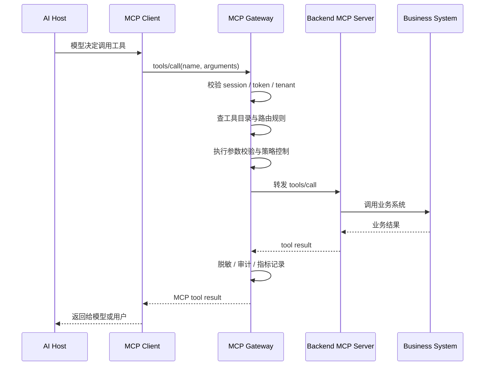

# MCP 服务与 MCP 网关详解

> 资料用途：用于准备 MCP 服务与 MCP 网关技术分享，可继续扩展为讲稿、架构设计文档或 PPT 大纲。  
> 整理日期：2026-05-30  
> 主要依据：MCP 官方 Specification 2025-06-18、官方架构文档，以及 Microsoft MCP Gateway、IBM ContextForge 等网关实践资料。

## 1. 一句话理解

MCP（Model Context Protocol）是一个让 AI 应用以标准方式连接外部工具、数据和上下文的协议。它把“模型如何调用外部能力”从各家应用的私有集成中抽出来，统一成一套可发现、可协商、可调用、可治理的协议接口。

可以把 MCP 看成 AI 应用世界里的“上下文与工具接入协议”：

- MCP 服务：把某个系统、数据源或能力包装成标准 MCP 接口。
- MCP 客户端：由 AI Host 创建，负责和某个 MCP 服务建立一条独立会话。
- MCP Host：承载用户交互和模型调用的应用，例如 IDE、桌面助手、Agent 平台。
- MCP 网关：不是 MCP 协议必须组件，而是企业级落地时常见的统一入口、代理、注册、鉴权、审计和治理层。

## 2. MCP 要解决什么问题

在没有 MCP 之前，AI 应用接入外部系统通常是点对点集成：

- 每个 AI 应用都要单独适配数据库、文件系统、业务 API、搜索服务、CI/CD、监控平台等。
- 每个外部工具都要为不同 Agent 或模型平台开发不同插件。
- 权限、审计、数据边界、工具描述、参数 schema、错误处理方式很难统一。
- 工具越多，集成复杂度越接近 `M x N`。

MCP 的目标是把这个关系改成标准协议：

```text
AI Host / Agent 平台  <-->  MCP Client  <-->  MCP Server  <-->  外部系统
```

这样 AI Host 只需要理解 MCP，外部能力也只需要暴露 MCP 服务，双方通过统一协议完成发现、能力协商、调用和结果返回。

## 3. MCP 核心架构

官方架构是 Client-Host-Server：



### 3.1 Host

Host 是用户真正使用的 AI 应用或 Agent 运行环境，负责：

- 创建和管理多个 MCP Client。
- 管理用户授权、工具调用确认、权限策略。
- 聚合来自多个 MCP 服务的上下文。
- 调用 LLM，并决定何时把工具、资源、提示词暴露给模型或用户。
- 维护不同 MCP 服务之间的安全边界。

### 3.2 Client

Client 由 Host 创建。一个 Client 通常只连接一个 Server，并维护一条有状态会话：

- 建立连接。
- 发起 `initialize`。
- 完成协议版本和能力协商。
- 转发请求、响应和通知。
- 管理资源订阅、服务端通知、采样请求等能力。

### 3.3 Server

Server 是 MCP 服务端，负责把某类外部能力标准化暴露出来：

- 暴露 tools、resources、prompts。
- 执行业务 API、数据库查询、文件操作、计算任务等。
- 返回结构化结果、文本、图片、音频或资源链接。
- 在需要时向客户端请求采样、用户输入或日志记录。

MCP Server 可以是本地进程，也可以是远程服务。

## 4. MCP 协议分层

MCP 可以拆成两层：

| 层 | 作用 | 关键内容 |
| --- | --- | --- |
| 数据层 | 定义消息语义 | JSON-RPC 2.0、生命周期、能力协商、tools/resources/prompts、通知 |
| 传输层 | 定义消息如何传递 | stdio、Streamable HTTP、自定义传输、授权、安全头、会话 ID |

所有 MCP 消息都基于 JSON-RPC 2.0，主要有三类：

- Request：需要对方响应的请求，例如 `tools/list`、`tools/call`、`resources/read`。
- Response：对 Request 的成功或失败响应。
- Notification：单向通知，不需要响应，例如列表变化通知、取消通知。

## 5. MCP 服务端三大核心能力

MCP Server 最重要的三个原语是 prompts、resources、tools。它们的控制权不同，这是理解 MCP 设计的关键。

| 原语 | 控制方 | 用途 | 示例 |
| --- | --- | --- | --- |
| Prompts | 用户控制 | 可复用提示词模板，由用户显式选择 | 代码审查模板、生成测试用例模板 |
| Resources | 应用控制 | 可附加给模型的上下文数据 | 文件内容、数据库记录、接口文档、日志片段 |
| Tools | 模型控制 | 可由模型根据任务自动选择调用的函数 | 查询订单、创建工单、执行 SQL、调用 HTTP API |

### 5.1 Tools

Tools 是 MCP 最常被关注的能力。它允许服务端定义一组可调用函数，每个工具有名称、描述和参数 schema。

适合暴露成 tool 的能力：

- 有明确输入输出。
- 能执行动作或查询。
- 可以被权限控制。
- 有稳定的错误语义。
- 可以通过 JSON Schema 描述参数。

示例工具定义思路：

```json
{
  "name": "query_order",
  "description": "根据订单号查询订单状态、金额和物流信息",
  "inputSchema": {
    "type": "object",
    "properties": {
      "orderId": {
        "type": "string",
        "description": "订单号"
      }
    },
    "required": ["orderId"]
  }
}
```

工具设计建议：

- 名称稳定、语义单一，避免一个工具承担太多职责。
- 描述写给模型看，要说明“什么时候用”和“不要什么时候用”。
- 参数 schema 尽量收敛，减少自由文本。
- 对高风险工具增加人工确认、权限校验、幂等键和审计日志。
- 返回结果优先结构化，便于模型二次推理。

### 5.2 Resources

Resources 用于暴露上下文数据。资源通常不表示“动作”，而表示“可读取的内容”。

适合暴露成 resource 的内容：

- 项目文件。
- 文档片段。
- 数据库记录。
- 日志、指标、链路追踪。
- 用户有权限访问的业务对象。

资源设计建议：

- URI 要稳定，例如 `file:///repo/README.md`、`db://orders/123`。
- 明确 MIME type。
- 对大资源提供分页、范围读取或摘要。
- 对敏感资源做权限裁剪和脱敏。

### 5.3 Prompts

Prompts 是服务端提供给用户或 Host 的可复用交互模板。

适合暴露成 prompt 的内容：

- 固定工作流模板。
- 某类业务分析模板。
- 团队规范化提示词。
- 少样本示例。

Prompt 通常由用户显式选择，而不是模型随意调用。这可以把团队经验沉淀为标准入口。

## 6. 生命周期与能力协商

MCP 会话通常经历三个阶段：



初始化阶段会完成：

- 协议版本兼容性确认。
- 客户端能力声明，例如 roots、sampling、elicitation。
- 服务端能力声明，例如 logging、prompts、resources、tools。
- 实现信息交换，例如 name、title、version。

能力协商的价值在于：双方只使用对方声明支持的功能，避免客户端假设服务端一定支持某些扩展能力。

## 7. 传输方式

### 7.1 stdio

stdio 适合本地 MCP 服务：

- Client 启动 Server 子进程。
- Client 通过 Server 的 stdin 写入 JSON-RPC 消息。
- Server 通过 stdout 输出 JSON-RPC 消息。
- stderr 可用于日志。
- stdout 不能输出非 MCP 消息，否则会破坏协议流。

典型场景：

- 本地文件系统。
- 本地 Git 仓库。
- 本地命令行工具。
- 开发调试型 MCP 服务。

### 7.2 Streamable HTTP

Streamable HTTP 适合远程 MCP 服务：

- Server 作为独立 HTTP 服务运行。
- 使用单一 MCP endpoint，例如 `https://example.com/mcp`。
- Client 通过 HTTP POST 发送 JSON-RPC 消息。
- Server 可返回 `application/json`，也可使用 SSE 流式返回。
- Client 可以通过 HTTP GET 打开 SSE 流，接收服务端消息。
- 服务端可通过 `Mcp-Session-Id` 维护有状态会话。
- HTTP 请求应携带 `MCP-Protocol-Version` 头，例如 `2025-06-18`。

安全要求：

- 校验 Origin，防止 DNS rebinding。
- 本地 HTTP 服务优先绑定 `127.0.0.1`。
- 远程服务应启用认证和授权。
- 会话 ID 应足够随机、不可预测。

## 8. MCP 授权模型

MCP 2025-06-18 规格对 HTTP 授权有明确说明：

- 授权是可选能力，但 HTTP 传输如果需要保护资源，应遵循 MCP 授权规范。
- 受保护 MCP Server 扮演 OAuth 2.1 Resource Server。
- MCP Client 扮演 OAuth Client。
- Authorization Server 负责用户认证、授权和令牌签发。
- MCP Server 需要实现 OAuth 2.0 Protected Resource Metadata，用于告诉客户端授权服务器位置。
- MCP Client 应支持通过 Resource Indicators 指定目标 MCP Server，避免令牌被错误复用。

简化流程：



落地建议：

- 不要把客户端拿到的 token 原样透传给下游业务 API。
- MCP Server 访问下游 API 时，应使用独立的下游凭证或 token exchange。
- token audience 必须校验，确保令牌确实签发给当前 MCP Server。
- 权限粒度要落到 tool、resource、tenant、用户身份和数据范围。

## 9. MCP 服务设计方法

设计一个 MCP Server 时，可以按下面顺序拆解。

### 9.1 明确边界

先回答：

- 这个服务代表哪个系统或能力域？
- 面向谁使用？
- 哪些能力允许模型自动调用？
- 哪些能力必须人工确认？
- 哪些数据永远不能暴露给模型？

推荐一个 MCP Server 聚焦一个能力域。例如：

- `git-mcp-server`：仓库状态、diff、commit、PR 信息。
- `order-mcp-server`：订单查询、退款申请、物流查询。
- `observability-mcp-server`：日志、指标、trace、告警。

### 9.2 把能力分类

| 能力类型 | 建议映射 |
| --- | --- |
| 查询类、操作类函数 | Tool |
| 文件、记录、文档、日志 | Resource |
| 标准分析流程、规范提示 | Prompt |
| 需要用户补充信息 | Elicitation |
| 需要模型生成中间结果 | Sampling |

### 9.3 定义工具契约

每个 tool 都应该有：

- 稳定名称。
- 清晰描述。
- JSON Schema 参数。
- 明确返回结构。
- 错误码和错误信息。
- 权限要求。
- 审计字段。
- 超时和重试策略。

### 9.4 处理副作用

会改变状态的工具要额外谨慎：

- 创建、删除、更新、发送、支付、审批等操作都属于高风险工具。
- 建议加入 dry run。
- 建议加入 confirmation。
- 建议加入 idempotency key。
- 建议记录调用者、参数摘要、审批结果和执行结果。

## 10. MCP 网关是什么

MCP 网关是位于 MCP Client 和多个 MCP Server 之间的统一入口。它不是官方协议的必选角色，而是生产环境常见基础设施。



可以把 MCP 网关理解为面向 Agent 时代的“工具与上下文控制平面 + 协议代理层”。

## 11. 为什么需要 MCP 网关

当 MCP 服务数量少、只在本地开发时，Host 直接连 Server 就够了。但在企业场景中，很快会遇到这些问题：

- 服务发现：哪些 MCP Server 可用？谁维护？版本是什么？
- 权限治理：不同用户、团队、租户能调用哪些工具？
- 安全审计：模型调用了什么工具？读了哪些资源？谁批准的？
- 会话管理：远程 MCP Server 需要 session affinity 和生命周期管理。
- 多租户隔离：不同租户的数据、凭证、工具列表不能串。
- 协议兼容：旧版 SSE、新版 Streamable HTTP、本地 stdio 服务如何统一接入？
- 流量控制：限流、熔断、超时、重试、隔离池。
- 工具治理：防止重复工具、影子 MCP 服务、恶意工具描述、越权工具。
- 可观测性：需要 tracing、metrics、日志和调用链。

网关的价值，就是把这些横切能力集中处理。

## 12. MCP 网关核心能力

| 能力 | 说明 |
| --- | --- |
| 服务注册与发现 | 维护 MCP Server 注册表，暴露可用工具、资源、提示词 |
| 统一入口 | 给 Host 提供一个或少数几个 MCP endpoint |
| 路由与代理 | 根据 tool/resource/prompt 路由到后端 MCP Server |
| 会话管理 | 管理 `Mcp-Session-Id`、SSE 流、连接保持、恢复 |
| 鉴权与授权 | 对接 OAuth、企业 SSO、RBAC、ABAC、租户权限 |
| 策略控制 | 对高风险工具做审批、阻断、脱敏、参数校验 |
| 协议转换 | 兼容 stdio、Streamable HTTP、旧 HTTP+SSE 或内部 RPC |
| 多租户隔离 | 用户、租户、环境、凭证和资源访问隔离 |
| 可观测性 | 记录工具调用、资源读取、延迟、错误、token 使用、trace |
| 生命周期管理 | 管理 MCP Server 的上线、下线、健康检查、版本发布 |
| 安全扫描 | 检查工具描述、参数 schema、依赖来源、敏感能力 |

## 13. MCP 网关参考架构

一个较完整的 MCP 网关可以分为数据面和控制面。



### 13.1 数据面

数据面处理实时 MCP 流量：

- 接收 MCP Client 请求。
- 校验协议版本、session、认证信息。
- 展开 tool/resource/prompt 的目标后端。
- 执行授权和策略。
- 转发请求到后端 MCP Server。
- 聚合响应并返回给 Client。

### 13.2 控制面

控制面处理管理动作：

- MCP Server 注册、审核、发布。
- 工具目录生成。
- 权限策略配置。
- 租户和环境隔离。
- 服务健康状态。
- 版本管理和灰度发布。

## 14. MCP 网关请求流程

以 `tools/call` 为例：



## 15. MCP 网关与传统网关的区别

| 对比项 | API Gateway | AI Gateway | MCP Gateway |
| --- | --- | --- | --- |
| 核心对象 | HTTP API | 模型请求 | MCP 工具、资源、提示词、会话 |
| 主要协议 | HTTP/REST/gRPC | OpenAI/Anthropic/模型 API | JSON-RPC over stdio/HTTP/SSE |
| 关注点 | API 路由、鉴权、限流 | 模型路由、token、成本、内容安全 | 工具治理、上下文治理、会话、MCP 能力协商 |
| 调用发起方 | 人或应用代码 | 应用代码 | LLM/Agent 经 Host 间接发起 |
| 风险特点 | API 越权、流量攻击 | Prompt 注入、数据泄露 | 工具滥用、资源泄露、跨工具组合攻击、影子服务 |

实际落地时三者可能共存：

```text
Agent Platform -> AI Gateway -> LLM Provider
Agent Platform -> MCP Gateway -> MCP Servers -> API Gateway -> Business APIs
```

## 16. 部署模式

### 16.1 本地直连

```text
Desktop Host -> stdio -> Local MCP Server
```

优点：

- 简单。
- 适合开发者工具。
- 可以访问本地文件和命令。

风险：

- 本地权限边界弱。
- Server 供应链风险高。
- stdio 服务如果被恶意替换，可能导致本地代码执行或数据泄露。

### 16.2 远程直连

```text
Host -> Streamable HTTP -> Remote MCP Server
```

优点：

- 服务集中部署。
- 便于对接 SaaS 和企业 API。

风险：

- 需要完善 OAuth、token 校验、CORS/Origin、租户隔离。
- 多个 Host 直连多个 Server 时治理分散。

### 16.3 企业网关模式

```text
Host -> MCP Gateway -> 多个 MCP Server
```

优点：

- 统一入口。
- 统一审计。
- 统一权限。
- 便于服务目录和生命周期管理。

风险：

- 网关成为关键基础设施，需要高可用。
- 需要处理流式连接、会话粘性和后端隔离。
- 工具目录聚合后要避免命名冲突和权限误合并。

### 16.4 Kubernetes / 云原生模式

```text
Ingress -> MCP Gateway -> MCP Server Pods -> Business Services
```

适合：

- 大量 MCP Server。
- 多租户。
- 弹性伸缩。
- 需要健康检查、灰度发布、统一观测。

## 17. 安全重点

MCP 的安全难点来自一个事实：模型可以根据上下文主动选择工具，而工具可能读数据或执行动作。

重点风险：

- 工具权限过大。
- Prompt injection 诱导模型调用敏感工具。
- 工具描述被污染，让模型误用工具。
- 资源读取越权。
- 跨工具组合导致数据外泄。
- 影子 MCP Server 未经审批接入。
- token audience 校验缺失。
- stdio 本地服务被替换或劫持。
- HTTP 服务未校验 Origin，遭遇 DNS rebinding。
- 缺少调用审计，事后无法追踪。

推荐控制：

- 最小权限：tool、resource、tenant、user 多维度授权。
- 人在回路：高风险操作必须确认。
- 工具分级：只读、写入、外发、财务、生产变更分级管理。
- 参数校验：严格 JSON Schema，加业务规则校验。
- 输出脱敏：对 PII、密钥、内部 URL、凭证做 DLP。
- 会话隔离：不同用户、租户、Host、Server 不共享 session。
- token 校验：校验 issuer、audience、scope、expiry。
- 供应链治理：MCP Server 来源、版本、依赖、签名、扫描。
- 审计追踪：记录用户、模型、工具、参数摘要、结果摘要、审批链路。
- 网络隔离：本地服务绑定 localhost，远程服务启用 HTTPS 和 Origin 校验。

## 18. MCP 服务与网关落地清单

### 18.1 MCP Server Checklist

- 是否明确服务边界和数据边界？
- tools/resources/prompts 是否分类合理？
- tool 参数是否有 JSON Schema？
- tool 是否区分只读和写操作？
- 写操作是否支持 confirmation、dry run、idempotency？
- 是否有超时、重试、错误码？
- 是否记录审计日志？
- 是否做权限校验和数据脱敏？
- 是否支持协议版本和能力协商？
- 是否有单元测试和集成测试？

### 18.2 MCP Gateway Checklist

- 是否有 MCP Server 注册表？
- 是否支持工具目录聚合和命名空间？
- 是否支持 per-user、per-tenant 授权？
- 是否支持 session 管理和 Streamable HTTP？
- 是否支持后端健康检查和熔断？
- 是否对高风险工具执行策略？
- 是否记录完整调用链？
- 是否支持灰度、版本、回滚？
- 是否兼容 stdio、HTTP、旧版 SSE 或内部协议？
- 是否有安全扫描和影子服务发现机制？

## 19. 示例场景：企业订单 Agent

目标：让客服 Agent 能通过 MCP 查询订单、解释物流、创建退款申请。

### 19.1 MCP Server 设计

`order-mcp-server`：

- Tool：`query_order`
- Tool：`query_shipment`
- Tool：`create_refund_request`
- Resource：`order://{orderId}`
- Prompt：`analyze_customer_order_issue`

风险分级：

- `query_order`：只读，中风险，需要用户身份和订单归属校验。
- `query_shipment`：只读，低风险。
- `create_refund_request`：写操作，高风险，需要人工确认和幂等键。

### 19.2 MCP Gateway 策略

- 客服只能访问自己负责租户下的订单。
- 超过金额阈值的退款申请必须二次确认。
- 返回结果自动脱敏手机号和地址。
- 所有工具调用写入审计日志。
- 对 `create_refund_request` 设置限流和审批链路。

## 20. 技术分享建议结构

可以把分享拆成 6 个部分：

1. 背景：AI 应用为什么需要标准化工具接入。
2. MCP 基础：Host、Client、Server、JSON-RPC、tools/resources/prompts。
3. MCP 服务开发：如何把业务能力包装成 MCP Server。
4. 生产化挑战：权限、安全、审计、会话、多租户、可观测性。
5. MCP 网关：统一入口、注册发现、策略治理、路由代理。
6. 实战案例：用一个业务系统演示 MCP Server + Gateway 调用链路。

## 21. 术语速查

| 术语 | 说明 |
| --- | --- |
| MCP | Model Context Protocol，模型上下文协议 |
| Host | AI 应用容器，管理用户交互、模型和多个 MCP Client |
| Client | Host 创建的协议客户端，一个 Client 通常连接一个 Server |
| Server | 暴露 tools/resources/prompts 的 MCP 服务 |
| Tool | 模型可调用的函数 |
| Resource | 可提供给模型的上下文数据 |
| Prompt | 用户可选择的提示词模板 |
| Sampling | Server 通过 Client 请求 Host 让模型生成内容 |
| Elicitation | Server 通过 Client 请求用户补充信息 |
| Streamable HTTP | MCP 当前标准 HTTP 传输方式 |
| Gateway | 企业落地中的 MCP 统一入口和治理层 |

## 22. 参考资料

- [MCP 官方架构文档](https://modelcontextprotocol.io/docs/learn/architecture)
- [MCP Specification 2025-06-18 Architecture](https://modelcontextprotocol.io/specification/2025-06-18/architecture)
- [MCP Specification 2025-06-18 Base Protocol](https://modelcontextprotocol.io/specification/2025-06-18/basic/index)
- [MCP Specification 2025-06-18 Lifecycle](https://modelcontextprotocol.io/specification/2025-06-18/basic/lifecycle)
- [MCP Specification 2025-06-18 Transports](https://modelcontextprotocol.io/specification/2025-06-18/basic/transports)
- [MCP Specification 2025-06-18 Authorization](https://modelcontextprotocol.io/specification/2025-06-18/basic/authorization)
- [MCP Server Features Overview](https://modelcontextprotocol.io/specification/2025-06-18/server/index)
- [Microsoft MCP Gateway](https://microsoft.github.io/mcp-gateway/)
- [IBM ContextForge MCP Gateway Architecture](https://ibm.github.io/mcp-context-forge/architecture/)
- [CoSAI Model Context Protocol Security](https://www.coalitionforsecureai.org/wp-content/uploads/2026/03/model-context-protocol-security-1.pdf)

